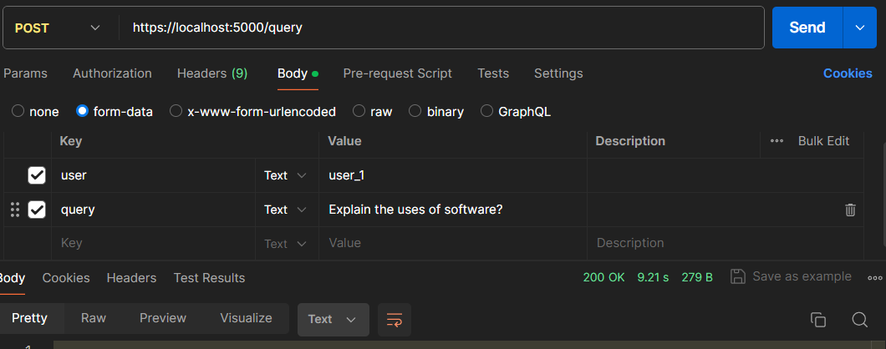

Here's a README file for your project:

---

# LangChain File Access Based Question Answering System

LangChain is a question-answering system built on top of the OpenAI language model. It allows users to ask questions and receive concise answers based on the content of accessible text documents for that specific user.

## Installation

1. **Clone the repository:**

    ```bash
    git clone https://github.com/yourusername/langchain.git
    ```

2. **Install dependencies:**

    ```bash
    cd langchain
    pip install -r requirements.txt
    ```

3. **Additional installation steps (if any)**

    If you encounter any issues during installation, please refer to the project documentation.

## Usage

To use LangChain, follow these steps:

1. Ensure that your text documents are stored in the `sample_project_text_files` directory.
2. Start the LangChain server by running:

    ```bash
    python main.py
    ```

3. Send a POST request to `http://localhost:5000/query` or `http://your-ip-address:5000/query with the following parameters:
   - `user`: The username of the user making the query.
   - `query`: The question/query to be answered.

   Example:
   
   ```bash
   curl -X POST -d "user=user_1&query=What is the capital of France?" http://localhost:5000/query
   ```
   
   This will return a JSON response containing the answer to the query and the source documents used for answering.

4. OR You can use Postman to send simple post request as below JQuery example
   
   ```bash
   var form = new FormData();
   form.append("user", "user_1");
   form.append("query", "Explain the uses of software?");
   
   var settings = {
     "url": "https://localhost:5000/query",
     "method": "POST",
     "timeout": 0,
     "processData": false,
     "mimeType": "multipart/form-data",
     "contentType": false,
     "data": form
   };
   
   $.ajax(settings).done(function (response) {
     console.log(response);
   });
   ```


## License

[MIT License](https://opensource.org/licenses/MIT) - LangChain is licensed under the MIT License.

---

Replace `yourusername` with your GitHub username in the installation instructions. You can also modify and expand this README to include more detailed information about your project.